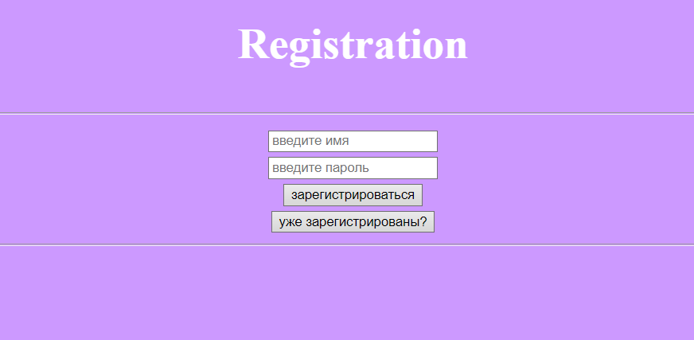
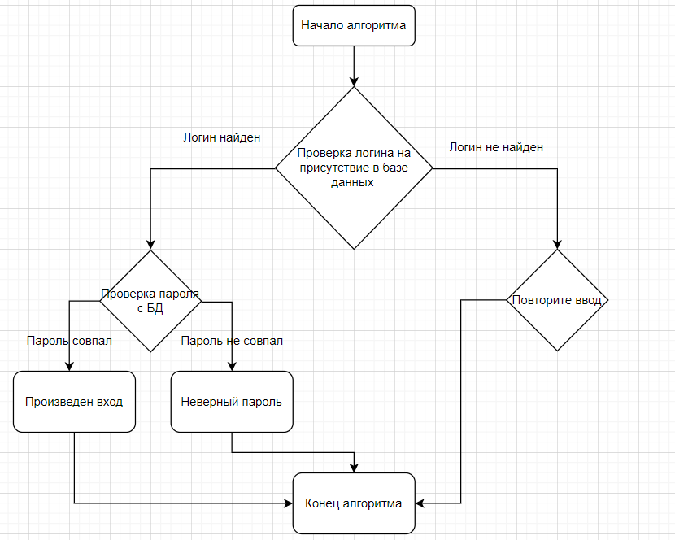
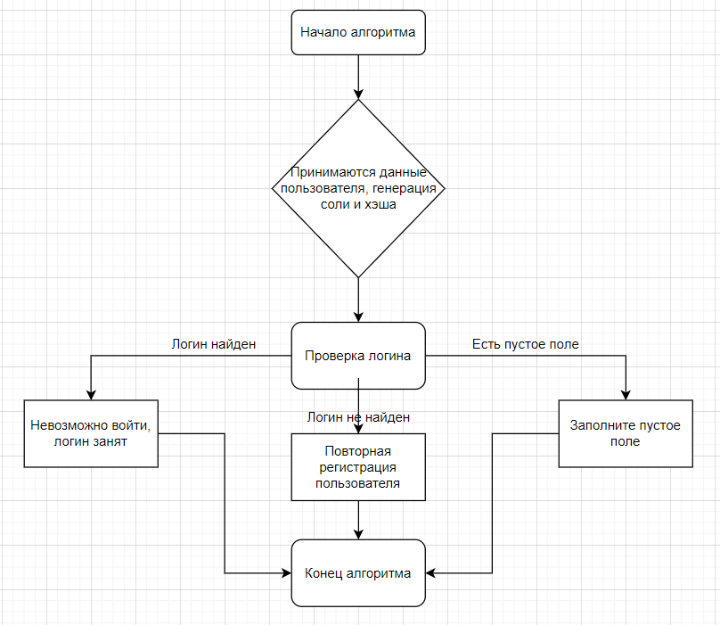
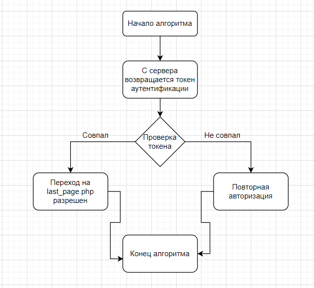

#Отчет к лабораторной работе №1
***
##По курсу "основы программирования"
***
###Текст задания
**Цель работы** - спроектировать и разработать систему авторизации пользователей на протоколе HTTP. Выполненные требования:

-функциональность входа/выхода,
-хранение паролей в хешированном виде,
-форма регистрации,
-хранение хэша пароля с солью.
###Пользовательский интерфейс
Необходимо создать три страницы: входа, регистрации и главную страницу сайта.
1. Страница входа:

2. Регистрация:

3. Главная страница:

***
###Пользовательские сценарии работы
1. Пользователь вводит в адресной строке index.php и попадает на форму регистрации. Если пользователь уже зарегестрирован и его данные есть в базе данных, то ему необходимо ввести свои данные  и нажать на кнопку "Войти". После чего он окажется на главной странице сайта. 

2. Пользователь вводит в адресной строке index.php и попадает на форму входа. Если пользователь не зарегистрирован на сайте, то ему нужно нажать на кнопку "Еще не зарегистрированы?". После этого придумать логин и пароль, затем ввести их в нужные поля и он окажеться на главное странице сайта, а его данные занесуться в базу данных.
***
###Описание API сервера и его хореографии
Сервер использует HTTP POST запросы с полями  login (логин) и password (пароль).
1. Алгоритм входа на сайт - отправляется запрос, который возвращает данные о пользователе с отправленным логином. Если найдены не все данные, то на экране пользователь видит сообщение "Заполните это поле". Если найдены - пароль сверяется с захэшированным из базы данных и совершается вход. 
2. Алгоритм регистрации на сайте - отправляется запрос, который возвращает данные о потенциально новом пользователе. Если найдены не все данные, то на экране пользователь видит сообщение "Заполните это поле". Если найдены данные - происходит регистрация.

3. Функция аутентификации пользователя - происходит запрос на проверку логина и пароля. Если такого логина не было найдено в базе данных, то страница перезагрузится и пользователю надо будет ввести данные еще раз. Если введённый логин есть базе данных, то введённый пароль хэшируется и сверяется с паролем этого аккаунта. Если пароль подтвержден, то  он может пользоваться сайтом. 
***
###Описание структуры базы данных
Для администрирования сервера MySQL и просмотра содержимого базы данных используется браузерное приложение phpMyAdmin. Используется 3 столбцов:

1. "login" типа varchar для хранения логина пользователя,
2. "password" типа varchar для хранения пароля пользователя,
3. "token" типа varchar для хранения токена пользователя в хешированном виде.
###Описание алгоритмов
1. Алгоритм входа на сайт

2. Алгоритм регистрации на сайте

3. Алгоритм аутентификации

***
###Значимые фрагменты кода
1. Алгоритм входа на сайт
```<?php
    session_start();
    $token = rand(500000, 999999);
    setcookie("my.token", $token, time() + 60);
?>

<!DOCTYPE html>
<html lang="en">

    <head>
        <meta charset="UTF-8">
<title>Toucan Shoes</title>
<link rel="icon" href="toucan.png" type="image/x-icon">
<style>
    html {
        font-size: 22px
    }
    body {
        background-color: #cc99ff;
        color: #ffffff;
    }

</style>
    </head>

    <body>

        <h1><p align="center">Buy brand-new shoes here!</p></h1>

<hr>

<div align="center">


<form action="sign_in.php" method="POST">
    <input type="text" name="login" placeholder="введите имя" pattern="[a-zA-Z0-9]+" required /><br>
    <input type="password" name="psw" placeholder="введите пароль" required /><br>
    <input type="submit" value="войти"><br>
    <button formaction="index.php" formnovalidate
    >еще не зарегистрированы?</button>
</form>

    </body>

    <hr>

    

    </div>
</html>

```
2. Алгоритм регистрации на сайте 
```
<?php
    session_start();
    $token = rand(500000, 999999);
    setcookie("my.token", $token, time() + 60 * 5);
?>

<!DOCTYPE html>
<html lang="en">

    <head>
        <meta charset="UTF-8">
<title>Toucan Shoes</title>
<link rel="icon" href="toucan.png" type="image/x-icon">
<style>
    html {
        font-size: 22px
    }
    body {
        background-color: #cc99ff;
        color: #ffffff;
    }

</style>
    </head>

    <body>

        <h1><p align="center">Registration</p></h1>

<hr>

<div align="center">

        
        <form action="sign_up.php" method="post">
            <input type="text" name="login" placeholder="введите имя" pattern="[a-zA-Z0-9]+" required /><br>
            <input type="password" name="psw" placeholder="введите пароль" required /><br>
            <input type="submit" value="зарегистрироваться"><br>
            <button formaction="auth.php" formnovalidate
            >уже зарегистрированы?</button>
        </form>
    </body>

    <hr>

    

    </div>
</html>

```
3. Алгоритм аутентифиакции
```

    if ($result==false) {
        mysqli_close($con);
        header("Location: index.php",true,303);
        }
    else { 

        mysqli_close($con);
        header("Location: last_page.php",true,303);
    
    exit;
    }

```

